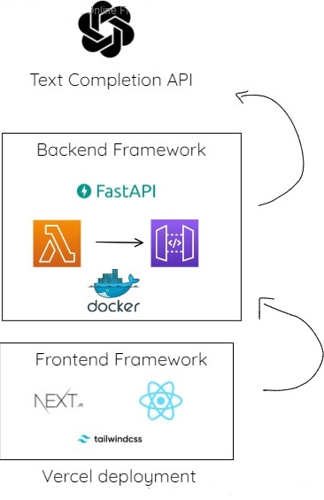

# BillboardAI

A Serverless AI bill board branding assistant for your product. Using OPENAI API for snippet and keywords recommendation.

## Architecture

## Frontend
Frontend is built using Typescript with Next .js/React .js framework and Tailwinds CSS. 
It is deployed on NextJS fast and scalable deployment platform Vercel.
## Backend
Backend is built using Python and FastAPI framework. The services interact with each other using AWS cloud services such AWS API Gateway, AWS Serverless Lambda and AWS Cloud Development Kit(CDK).

The environment for serverless is configured using Amazon Linux2 image for the AWS Lambda Layer using Docker containers.
## Demo
https://billboard-ai.vercel.app

## Authors

- [@AnshDesai](https://www.github.com/AnshDesai)

